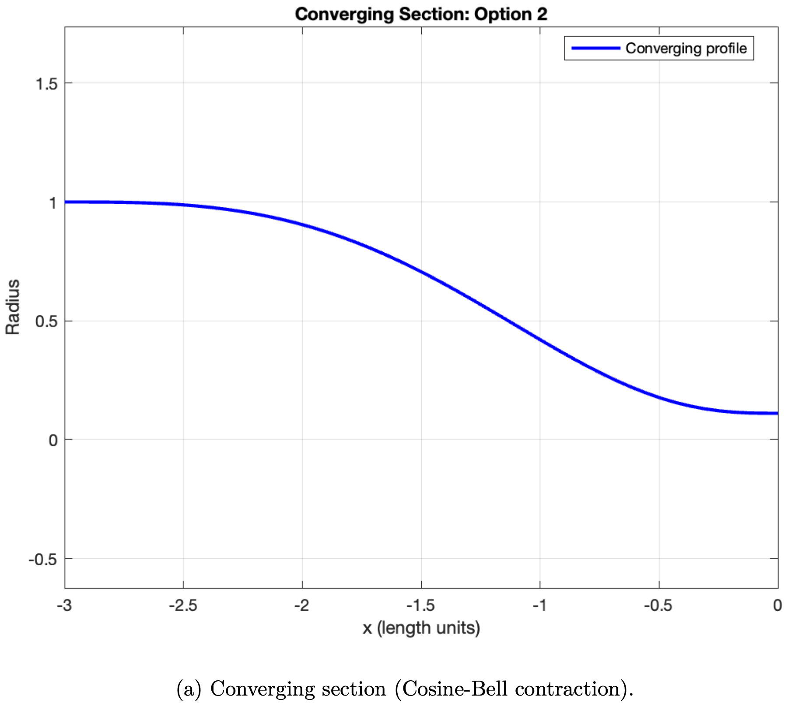
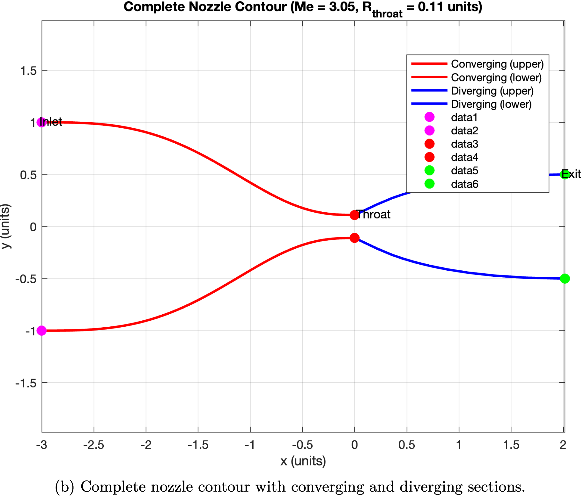
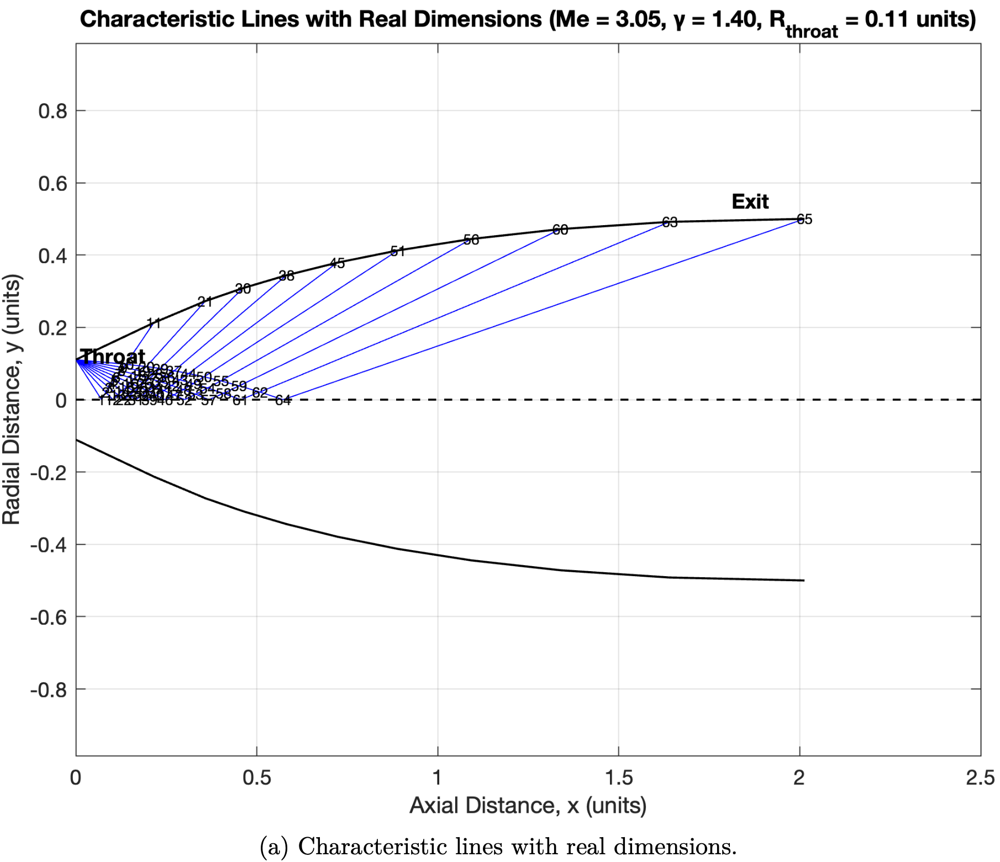
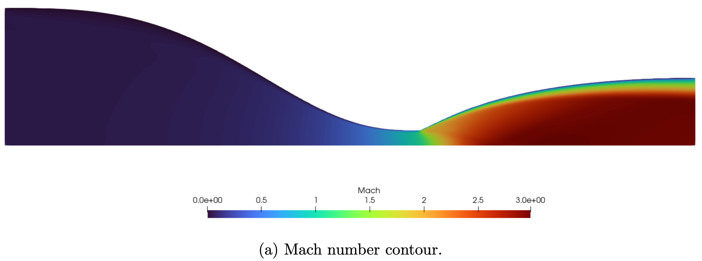
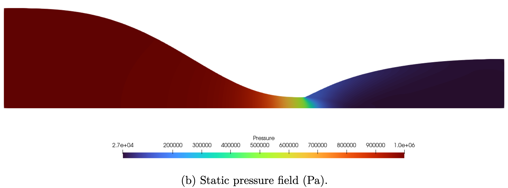
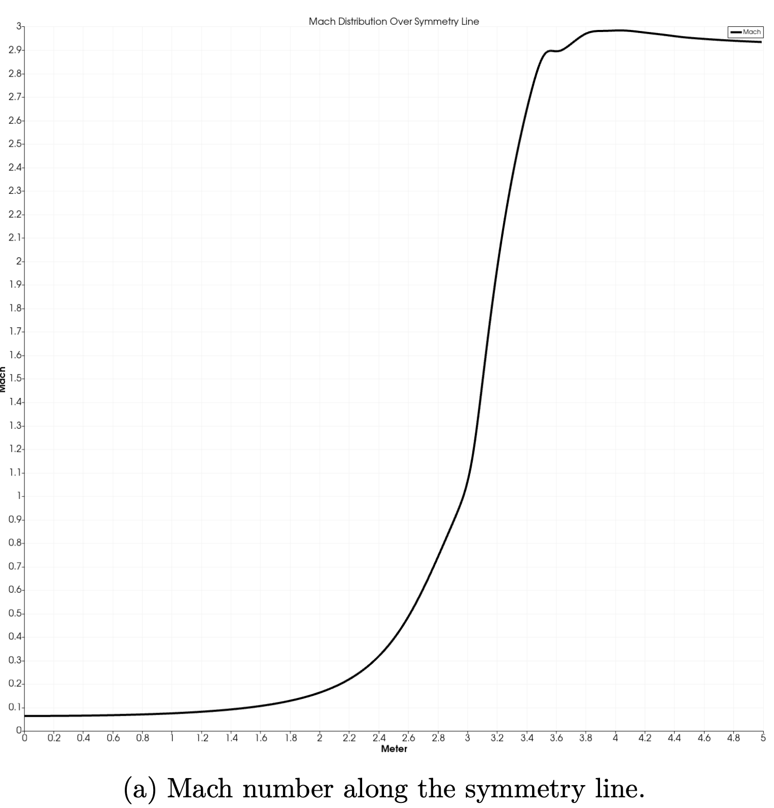
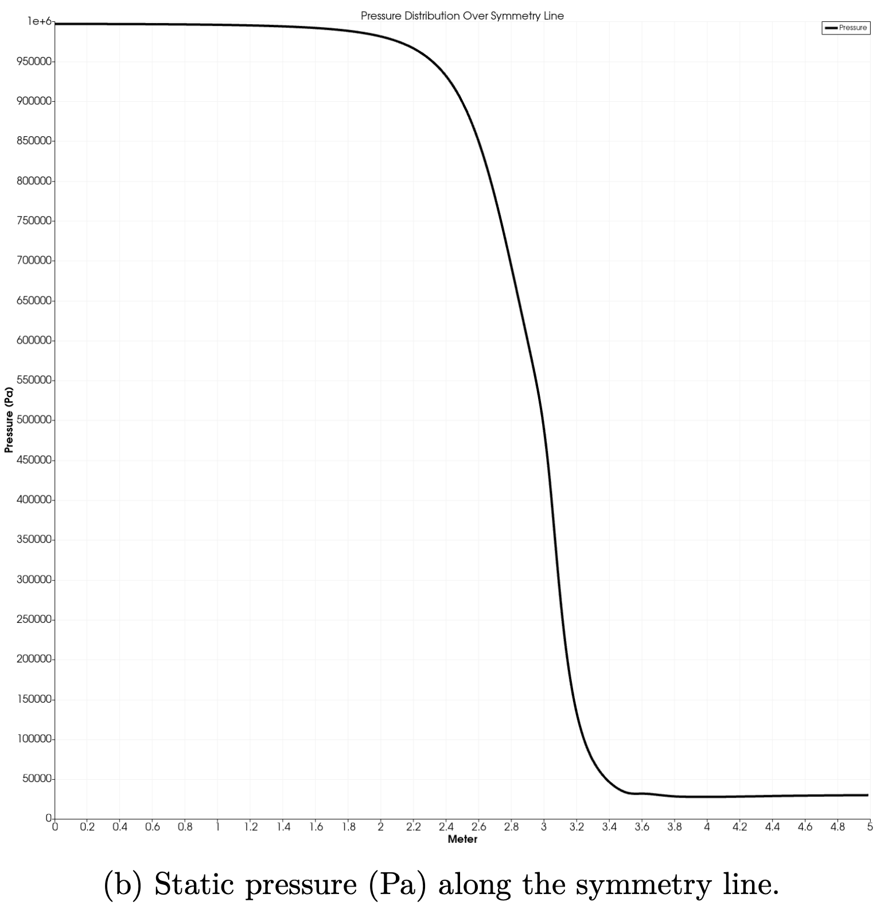

# CFD-Analysis-of-Minimum-Length-Nozzle-Designed-with-MOC

Design a minimum-length converging–diverging nozzle with the **Method of Characteristics (MoC)**, generate a block-structured quadrilateral mesh in **Gmsh**, and solve the compressible flow using **SU2 (RANS–SST)**.  
This repo contains the MATLAB design script, a Python mesher, an SU2 config, and example figures/results.


---

## Table of Contents

- [Features](#features)
- [Repository Layout](#repository-layout)
- [Requirements](#requirements)
- [Quick Start](#quick-start)
- [Workflow](#workflow)
- [Design Script (MATLAB)](#design-script-matlab)
- [Meshing Script (Python--Gmsh)](#meshing-script-python--gmsh)
- [SU2 Setup](#su2-setup)
- [Results](#results)
- [License](#license)

---

## Features

- **MoC nozzle design** with selectable converging profiles:
  - Circular Arc, Witoszyński (adjustable exponents), Bicubic, Conical, Cosine-bell, Quintic (“NASA smooth”), or “No converging section”.
- **Automatic characteristic net** and **minimum-length exit** (parallel, shock-free by construction).
- **Complete data export**: wall & full coordinates, *all* node properties, wall node properties, geometry features, and performance metrics (CSV + TXT).
- **Block-structured, transfinite quad mesh** in Gmsh with re-used vertical interfaces and symmetry axis.
- **SU2 RANS–SST** configuration for air with total-conditions inlet and fixed static outlet pressure.

---

## Repository Layout

<table>
  <thead>
    <tr>
      <th style="text-align:left;">Path</th>
      <th style="text-align:left;">Description</th>
    </tr>
  </thead>
  <tbody>
    <tr>
      <td><code>nozzle_design_with_moc.m</code></td>
      <td>MATLAB: MoC design + reports & figures</td>
    </tr>
    <tr>
      <td><code>gmsh_nozzle_mesh.py</code></td>
      <td>Python: block-structured mesh (Gmsh API)</td>
    </tr>
    <tr>
      <td><code>nozzle_su2_config.cfg</code></td>
      <td>SU2 config (RANS–SST, Roe, implicit)</td>
    </tr>
    <tr>
      <td><code>supersonic_nozzle.pdf</code></td>
      <td>Notes / short write-up</td>
    </tr>
    <tr>
      <td><code>nozzle_design_report.txt</code></td>
      <td>Example output report</td>
    </tr>
    <tr>
      <td><code>figures/</code></td>
      <td>
        PNG outputs (place images here)
        <ul>
          <li><code>characteristics.png</code></li>
          <li><code>converging_profile.png</code></li>
          <li><code>contour_complete.png</code></li>
          <li><code>mesh_blocks.png</code></li>
          <li><code>centerline_Mach.png</code></li>
          <li><code>centerline_pressure.png</code></li>
          <li><code>contours_mach_pressure.png</code></li>
        </ul>
      </td>
    </tr>
    <tr>
      <td><code>data/</code></td>
      <td>
        Auto-generated by MATLAB (examples)
        <ul>
          <li><code>*_complete_coordinates.csv</code></li>
          <li><code>*_diverging_coordinates.csv</code></li>
          <li><code>*_converging_coordinates.csv</code></li>
          <li><code>*_all_node_properties.csv</code></li>
          <li><code>*_wall_node_properties.csv</code></li>
          <li><code>*_nozzle_features.csv</code></li>
          <li><code>*_performance_metrics.csv</code></li>
          <li><code>*_summary.txt</code></li>
          <li><code>*_detailed_report.txt</code></li>
        </ul>
      </td>
    </tr>
  </tbody>
</table>

## Requirements

### OS
- Linux, macOS, or Windows (64-bit)

### Languages & Runtimes
- **MATLAB**: R2020a or newer (for `nozzle_design_with_moc.m`)
- **Python**: 3.9+ (tested with 3.10/3.11)

### Python Packages
- `gmsh` (Python API)
- `numpy`

```bash
SU2_CFD -h  # Show help to confirm SU2 is installed
pip install gmsh numpy
```

### External Tools

- **Gmsh** (v4.11+)
  - Purpose: Structured mesh generation from MATLAB MoC geometry.
  - Download: [https://gmsh.info](https://gmsh.info)
  - Add Gmsh to your system PATH to enable GUI previews.
  - Used by `gmsh_nozzle_mesh.py` to create a block-structured SU2 mesh.

- **SU2** (v7.5+ or newer, with RANS turbulence enabled)
  - Purpose: CFD simulation of compressible RANS–SST flows.
  - Download/build: [https://su2code.github.io](https://su2code.github.io)
  - Ensure `SU2_CFD` (Linux/macOS) or `SU2_CFD.exe` (Windows) is on your PATH.
  - Check installation:

```bash
SU2_CFD -h  # Show help to confirm SU2 is installed
```
## Quick Start

Follow these steps to run the full workflow from nozzle design to CFD simulation.

### 1. Design the Nozzle Contour (MATLAB)

```matlab
% In MATLAB:
run('nozzle_design_with_moc.m')
```

This script will:
- Compute MoC-generated wall points for a supersonic nozzle.
- Export coordinates to `data/nozzle_wall.txt`.
- Save contour plots in `figures/`.

### 2. Generate Mesh Using Python + Gmsh

```bash
python gmsh_nozzle_mesh.py
```

This script will:
- Read wall points (from MoC output or hardcoded profile).
- Create structured mesh using `Transfinite` lines and surfaces.
- Export mesh as `nozzle_xy_conformal.su2`.

> Tip: Set `SHOW_GUI=True` in the script to preview mesh in Gmsh GUI.

### 3. Run CFD Simulation with SU2

```bash
SU2_CFD nozzle_su2_config.cfg
```

This will:
- Run compressible RANS-SST simulation on the nozzle mesh.
- Output results: `flow.csv`, `surface_flow.csv`, `restart_flow.dat`, and `.vtk` files.
- Save convergence history in `history.csv`.

### 4. Visualize the Results

Use:
- **ParaView**: For `.vtk` files (Mach number, pressure, etc.)
- **Python/Matplotlib**: For centerline plots from CSVs.
- **Gmsh**: For mesh inspection.
- **MATLAB**: For overlay plots or additional analysis.

### Optional: Modify Simulation Parameters

Edit `nozzle_su2_config.cfg` to:
- Adjust inlet/outlet pressure.
- Switch turbulence model.
- Change CFL settings or output format (Tecplot, CSV, Paraview, etc).

##  Workflow

This section outlines the full end-to-end process of designing a 2D supersonic nozzle using the Method of Characteristics (MoC), generating a conformal mesh, and simulating compressible flow using SU2.

---

### Step 1: Nozzle Contour Generation (MATLAB)

**Script**: `nozzle_design_with_moc.m`

- Implements the Method of Characteristics (MoC) to design a minimum-length supersonic nozzle.
- Inputs include design Mach number, throat radius, and expansion angle.
- Outputs:
  - Wall coordinates saved as `nozzle_wall.txt`
  - Internal MoC mesh points for visualization
  - Figures showing characteristics lines and nozzle shape in `/figures/`

---

### Step 2: Mesh Generation with Gmsh (Python)

**Script**: `gmsh_nozzle_mesh.py`

- Uses the Gmsh Python API to generate a structured 2D mesh.
- Geometry is built from the MoC-generated wall shape.
- Boundary layers and symmetric midline are included.
- Transfinite and recombine features ensure high mesh quality for CFD.
- Outputs:
  - `.su2` format mesh file (e.g., `nozzle_xy_conformal.su2`)
  - Optional Gmsh GUI preview if `SHOW_GUI = True` is set.

---

### Step 3: CFD Simulation with SU2

**Config file**: `nozzle_su2_config.cfg`

- Solver: `RANS` with `SST` turbulence model
- Boundary Conditions:
  - Inlet: Total Pressure and Total Temperature
  - Outlet: Fixed static pressure
  - Wall: No-slip, adiabatic
  - Symmetry: Midline
- Mesh and solver settings tailored for compressible, high-speed flow.
- Outputs:
  - Volume solution: `flow.csv`
  - Surface data: `surface_flow.csv`
  - Restart data: `restart_flow.dat`
  - Residual history: `history.csv`
  - VTK files for visualization (if enabled)

---

### Step 4: Post-Processing and Visualization

- **ParaView**: View Mach number, pressure, density contours.
- **Python**: Analyze `flow.csv` and `surface_flow.csv` for centerline plots.
- **MATLAB**: Compare CFD results with theoretical MoC lines.
- **Figures**: Screenshots include:
  - Characteristic mesh
  - Conformal grid
  - Mach number and pressure contours
  - Centerline pressure and Mach distribution

---

### Summary of Outputs

| Stage          | Output Type                     | Example File                |
|----------------|----------------------------------|-----------------------------|
| MATLAB         | Wall coordinates + plots         | `nozzle_wall.txt`, `/figures/` |
| Python (Gmsh)  | Structured SU2 mesh              | `nozzle_xy_conformal.su2`  |
| SU2 Solver     | Simulation results               | `flow.csv`, `.vtk`, `.dat` |
| Post-processing| Visual plots & analysis          | ParaView screenshots, CSV  |

This modular workflow enables rapid prototyping and validation of nozzle designs under compressible flow conditions.

##  Design Script (MATLAB)

The nozzle design process begins with the **`nozzle_design_with_moc.m`** MATLAB script, which uses the **Method of Characteristics (MoC)** to compute a smooth, minimum-length supersonic nozzle contour.

---

### Key Features

- **MoC for Supersonic Flow**: Computes the expansion region using characteristic lines for a given design Mach number.
- **Throat & Exit Control**: Starts from a throat section and expands the flow through a controlled angle until desired exit Mach is reached.
- **Visualization**: Plots the characteristic mesh and nozzle wall in `figures/`.

---

### Inputs

Set at the top of the script:

- `M_exit` – Desired exit Mach number (e.g., 2.0)
- `gamma` – Specific heat ratio (e.g., 1.4 for air)
- `n_char_lines` – Number of characteristic lines
- `R_throat` – Radius of throat
- `theta_max` – Maximum expansion angle (degrees)

---

### Outputs

| Output File/Folder     | Description                                       |
|------------------------|---------------------------------------------------|
| `data/nozzle_wall.txt` | Wall coordinates from MoC (x, y) for meshing      |
| `figures/`             | Contains plots for:                               |
|                        | - Characteristic mesh                             |
|                        | - Nozzle wall profile                             |
|                        | - Expansion angle distributions                   |

---

### Method Summary

1. **Prandtl-Meyer Function**: Converts Mach number to flow deflection angle.
2. **MoC Grid Generation**: Builds characteristic lines from throat to exit.
3. **Wall Points Extraction**: Locates wall shape by following the compatibility equations (K+ and K−).
4. **Smoothing/Filtering**: Optional step for better meshing compatibility.
5. **Export**: Wall coordinates written to `nozzle_wall.txt` for later use.

---

### Visualization Example

Plots include:
- θ vs x distribution
- MoC grid lines
- Nozzle shape overlaid with centerline

All plots are saved as `.png` in the `figures/` folder for documentation or reporting.

---

### How to Run

```matlab
run('nozzle_design_with_moc.m')
```

This will automatically generate wall point data and figures.

>  Note: You can modify `save_figures = true` or `write_wall_file = true` flags inside the script to control outputs.

##  Meshing Script (Python + Gmsh)

The `gmsh_nozzle_mesh.py` script uses the **Gmsh Python API** to generate a structured 2D mesh compatible with SU2, based on the nozzle wall profile generated by the MATLAB MoC script.

---

### Key Features

- **Structured Mesh**: Uses `Transfinite` lines and `Recombine` surfaces for high-quality structured grid.
- **Boundary Definition**: Automatically detects wall, symmetry, inlet, and outlet boundaries.
- **Mesh Quality**: Smooth element distribution from throat to exit.
- **SU2 Export**: Saves mesh in `.su2` format directly usable by SU2 CFD solver.

---

### Inputs

- `data/nozzle_wall.txt`: Wall coordinates generated by `nozzle_design_with_moc.m`.
- Optional hardcoded wall data if the file is not present.

Internal Parameters (editable at top of script):
- `num_points_x`, `num_points_y`: Controls mesh density.
- `inlet_length`, `outlet_length`, `height`: Defines domain size.
- `SHOW_GUI`: Toggle Gmsh GUI preview mode.

---

### Outputs

| File                          | Description                              |
|-------------------------------|------------------------------------------|
| `nozzle_xy_conformal.su2`     | 2D mesh file compatible with SU2         |
| (optional GUI preview)        | If `SHOW_GUI = True`, opens Gmsh window |

---

### Boundary Tags

Used in `nozzle_su2_config.cfg`:

| Boundary Name | Description         |
|---------------|---------------------|
| `INLET`       | Left vertical edge  |
| `OUTLET`      | Right vertical edge |
| `WALL`        | Nozzle contour      |
| `SYMMETRY`    | Horizontal midline  |

These names match the `MARKER_` entries in SU2 config.

---

### How to Run

Make sure Gmsh and Python API are installed:

```bash
pip install gmsh
```

Then run:

```bash
python gmsh_nozzle_mesh.py
```

>  If you want to visualize the mesh before exporting, set `SHOW_GUI = True` in the script.

---

### Notes

- The mesh resolution is user-controlled. Refine `num_points_x/y` for better accuracy or faster runs.
- Gmsh `.geo` format is not required; mesh is built programmatically.
- You can integrate this script into a larger workflow or GUI.

## SU2 Setup

This section describes how to configure and run the CFD simulation of the nozzle using **SU2**, an open-source software for solving compressible flow problems. The simulation is configured using the `nozzle_su2_config.cfg` file.

---

### Overview

- **Solver**: Reynolds-Averaged Navier-Stokes (RANS)
- **Turbulence Model**: SST (Shear Stress Transport)
- **Flow**: 2D, compressible, viscous
- **Mesh**: Structured SU2 format (`.su2`)
- **Boundary Conditions**:
  - Inlet: Total Pressure & Temperature
  - Outlet: Static Pressure
  - Wall: No-slip, adiabatic
  - Symmetry: Midline

---

### Key Configuration Settings (`nozzle_su2_config.cfg`)

| Parameter                    | Value                | Description                                        |
|-----------------------------|----------------------|----------------------------------------------------|
| `SOLVER`                    | `RANS`               | Governing equations                                |
| `KIND_TURB_MODEL`           | `SST`                | Turbulence model                                   |
| `MATH_PROBLEM`              | `DIRECT`             | Solving the primal flow problem                    |
| `FREESTREAM_PRESSURE`       | `1000000.0` Pa       | Inlet total pressure                               |
| `FREESTREAM_TEMPERATURE`    | `288.15` K           | Inlet total temperature                            |
| `MARKER_RIEMANN`            | `INLET`              | Total conditions defined at inlet                  |
| `MARKER_OUTLET`             | `OUTLET, 25000.0`    | Outlet static pressure                             |
| `MARKER_HEATFLUX`           | `WALL, 0.0`          | Adiabatic no-slip wall                             |
| `MARKER_SYM`                | `SYMMETRY`           | Horizontal symmetry plane                          |
| `CONV_NUM_METHOD_FLOW`      | `ROE`                | Flux scheme for flow equations                     |
| `TIME_DISCRE_FLOW`          | `EULER_IMPLICIT`     | Implicit time discretization                       |
| `CFL_ADAPT`                 | `YES`                | Adaptive CFL number for convergence                |
| `ITER`                      | `10000`              | Max number of iterations                           |
| `CONV_RESIDUAL_MINVAL`      | `-24`                | Convergence threshold                              |
| `VOLUME_FILENAME`           | `flow`               | Output file for volume flow variables              |
| `SURFACE_FILENAME`          | `surface_flow`       | Output for surface pressure/Mach/etc.              |
| `CONV_FILENAME`             | `history`            | Residuals history output                           |
| `OUTPUT_WRT_FREQ`           | `100`                | Write results every N iterations                   |
| `MESH_FILENAME`             | `nozzle_xy_conformal.su2` | Input mesh file                             |

---

### How to Run the Simulation

Once SU2 is installed and your terminal is in the repo directory:

```bash
SU2_CFD nozzle_su2_config.cfg
```

This will launch the solver and begin iterating until the convergence criteria is met or the maximum number of iterations is reached.

> 💡 Tip: Use `SU2_CFD --parallel` for parallel execution on multicore systems.

---

### Output Files

| File Name                | Purpose                                 |
|--------------------------|------------------------------------------|
| `flow.csv`               | Volume-averaged flow variables           |
| `surface_flow.csv`       | Surface pressure, Mach, etc.             |
| `history.csv`            | Convergence history over iterations      |
| `restart_flow.dat`       | Save point for continuing simulation     |
| `flow.vtk`               | VTK file for visualization in ParaView   |

---

### Visualization

- Use **ParaView** to view `.vtk` files (Mach, pressure, etc.)
- Use **Python** or **Excel** to plot `history.csv` and `surface_flow.csv`.
- Overlay results with MATLAB theoretical MoC wall contours if desired.

---

### Notes

- The simulation assumes air as an ideal gas with `γ = 1.4`.
- The mesh and solver settings are tuned for high-speed nozzle flow (low subsonic to supersonic).
- Feel free to modify outlet pressure or geometry to test choked/over-expanded/under-expanded regimes.

## Results

The following results demonstrate the flow behavior inside a converging-diverging supersonic nozzle designed for an exit Mach number of **3.05** using compressible RANS-SST simulations via SU2.

This nozzle was designed using the **Method of Characteristics (MoC)** to ensure a **shock-free** expansion. The SU2 simulations confirm the design goal, with smooth and consistent flow acceleration from subsonic inlet to supersonic exit.

### Nozzle Geometry Design

- **Converging Section Profile**  
  The smooth contraction profile generated using a cosine-bell function ensures subsonic to sonic transition.  
  
  
- **Complete Nozzle Contour**  
  Final nozzle geometry combining the cosine-bell converging section and MoC-based diverging section.  
  

  - **MoC Characteristic Lines**  
  Visualization of characteristic lines generated from the MoC design procedure, used to construct the divergent section.  
  
  
### Flowfield Contours

- **Mach Number Distribution**  
  The Mach contour confirms shock-free expansion through the nozzle. The flow accelerates smoothly and reaches the design Mach number of **3.05** at the exit.  
  

- **Static Pressure Field**  
  Pressure decreases continuously through the throat and divergent section with no signs of shock patterns, confirming an isentropic expansion.  
  

### Centerline Flow Properties

- **Centerline Mach Number**  
  The flow accelerates smoothly from subsonic to the design exit Mach number of **3.05**.  
  

- **Centerline Static Pressure**  
  Static pressure drops consistently through the nozzle, with no abrupt changes, indicating no shock waves.  
  

  ## License

This project is licensed under the MIT License.

MIT License

Copyright (c) 2025 Enes Celik


